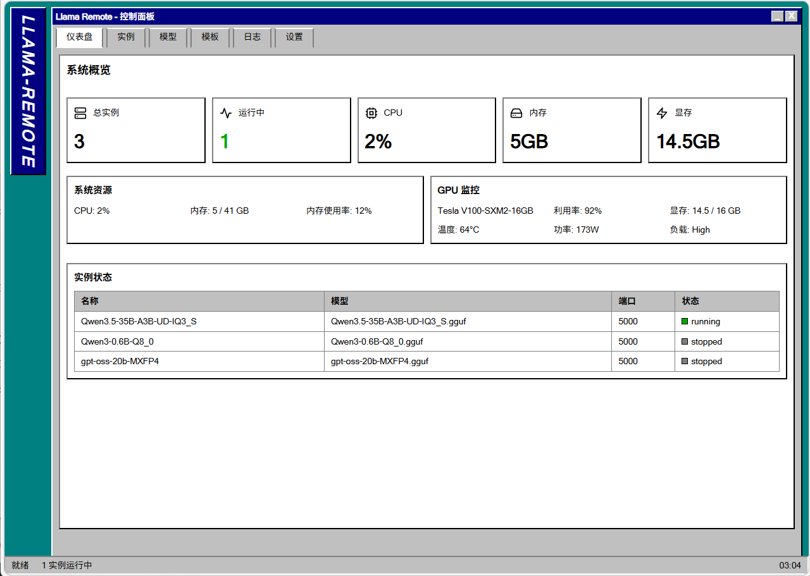

# Llama Remote

[English](#english) | [中文](#中文)

---

## English

### What is this? 🤔

Imagine you have a powerful GPU server running in your home or data center, but you want to control your AI models from anywhere — your phone, laptop, or tablet. That's exactly what Llama Remote does.

It's a simple yet powerful web-based control panel that lets you manage multiple llama.cpp instances remotely. Think of it as a remote control for your AI models.

### Features

- **🌐 Web-based UI** — Control everything from any browser
- **💻 Multiple Instances** — Run several AI models simultaneously
- **📊 Real-time Monitoring** — Watch GPU and system stats live
- **🔒 Optional Authentication** — Password protection when you need it
- **💾 Persistent Storage** — Instances survive server restarts

### Quick Look



### Getting Started

```bash
# Clone and run
git clone https://github.com/stlin256/llama-remote.git
cd llama-remote

# Run the server
./llama-remote -port 8000
```

Then open `http://localhost:8000` in your browser.

### Configuration

The first time you run it, you might want to configure:

- **llama.cpp binary path** — Where your `llama-server` lives
- **Models directory** — Where your GGUF model files are stored
- **Authentication** — Enable password protection (optional)

All config lives in `~/.llama-remote/config.yaml`.

### Why this exists?

I built this because I wanted to run AI models on my home server but needed a clean way to manage them from my laptop or phone. The native llama.cpp server is great, but it doesn't have a GUI. So I made one.

### Tech Stack

- **Backend**: Go + Gorilla Mux
- **Frontend**: React + TypeScript + Vite
- **Style**: Windows 98 nostalgia 🎮

---

## 中文

### 这是什么？ 🤔

想象一下，你有一台强大的 GPU 服务器运行在家里或数据中心，但你想随时随地控制 AI 模型——用手机、笔记本或平板。Llama Remote 正是为此而生。

这是一个简洁但功能强大的网页控制面板，让你可以远程管理多个 llama.cpp 实例。可以把它想象成 AI 模型的遥控器。

### 功能特性

- **🌐 网页界面** — 浏览器随时可控
- **💻 多实例** — 同时运行多个 AI 模型
- **📊 实时监控** — 随时查看 GPU 和系统状态
- **🔒 可选认证** — 需要时开启密码保护
- **💾 持久存储** — 实例配置自动保存

### 一目了然


### 快速开始

```bash
# 克隆并运行
git clone https://github.com/stlin256/llama-remote.git
cd llama-remote

# 启动服务器
./llama-remote -port 8000
```

然后在浏览器打开 `http://localhost:8000`。

### 配置

首次运行可能需要配置：

- **llama.cpp 路径** — 你的 `llama-server` 在哪里
- **模型目录** — 你的 GGUF 模型文件存放在哪
- **认证** — 开启密码保护（可选）

所有配置保存在 `~/.llama-remote/config.yaml`。

### 为什么要做这个？

我之所以做这个，是因为我想在家用服务器上运行 AI 模型，但需要一个简洁的方式从笔记本或手机管理它们。原生的 llama.cpp 服务器很棒，但没有图形界面。所以我自己做了一个。

### 技术栈

- **后端**: Go + Gorilla Mux
- **前端**: React + TypeScript + Vite
- **风格**: Windows 98 怀旧风 🎮

---

### License

MIT License — do whatever you want.
